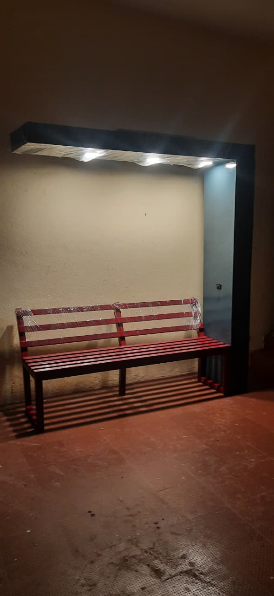

# 🌞 Smart Solar Bench Power System

This project demonstrates a **Solar Bench Power System** designed for public use to provide renewable energy-based USB charging and lighting.  
The system uses **solar panels**, a **PWM charge controller**, and a **12V battery** to efficiently manage and distribute solar power.

---

## ⚙️ System Overview

**Components:**
- 3 × 35 W Solar Panels (connected in parallel)
- 1 × PWM Solar Charge Controller
- 1 × 12 V 12 Ah DC Battery
- 3 × 12 V DC LED Bulbs (connected in parallel)
- 1 × Dual USB Charging Port (5 V output)
- Wiring and connectors

**Working Principle:**
- Solar panels convert sunlight into DC electricity.
- The PWM charge controller regulates the voltage/current to safely charge the battery.
- The battery stores energy and powers the lights and USB charging ports when sunlight is unavailable.
- Loads (lights and USB ports) are powered through the controller’s load output.

---

## 🔋 Energy Calculation

| Component | Power (W) | Quantity | Total (W) |
|------------|------------|-----------|-----------|
| Solar Panel | 35 | 3 | **105 W** |
| DC Bulb | 12 | 3 | **36 W** |
| USB Charger | 10 | 1 | **10 W** |
| **Total Load** |  |  | **≈46 W** |

**Battery Capacity:**  
12 V × 12 Ah = **144 Wh** (usable ≈ 115 Wh considering 80% efficiency)

**Backup Duration:**  
115 Wh ÷ 46 W ≈ **2.5 hours** (for full load)

**Charging Time:**  
105 W solar input ÷ 12 V ≈ 8.75 A  
12 Ah ÷ 8.75 A ≈ **1.5–2 hours** (under full sunlight)

---

## 🧠 Innovation & Improvements

- **Renewable & Self-Sustained:** Runs entirely on solar power.  
- **Smart Load Management:** PWM controller prevents overcharging/discharging.  
- **Hybrid Energy Option:** Can integrate pedal dynamo or mini wind turbine for cloudy days.  
- **User-Friendly:** Provides both lighting and USB charging.  
- **Scalable Design:** More panels or batteries can be added easily.  
- **Educational Value:** Demonstrates real-world solar energy applications.  

---

## 🪛 Circuit Diagram

---

## Prototype

---

## 🧰 Future Enhancements

- Replace PWM with **MPPT Controller** for 20–30% better efficiency.  
- Add **IoT monitoring** for voltage, current, and battery status.  
- Integrate **auto night light sensor** and **solar tracking system**.  

---

## 🧾 License

This project is open-source and available under the [MIT License](LICENSE).

---

## 👤 Author

**Giriprasath T K**  
📧 tkcharan8@gmail.com

🔗[ [LinkedIn](https://www.linkedin.com/)  ](https://www.linkedin.com/in/giri-prasath-tk-a05150266?utm_source=share&utm_campaign=share_via&utm_content=profile&utm_medium=android_app)
